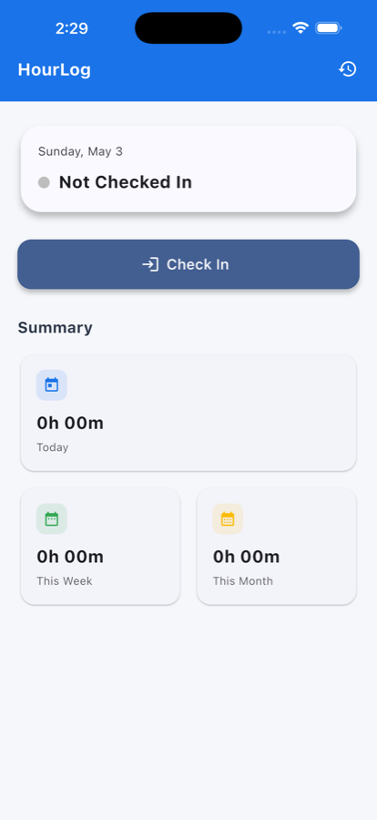
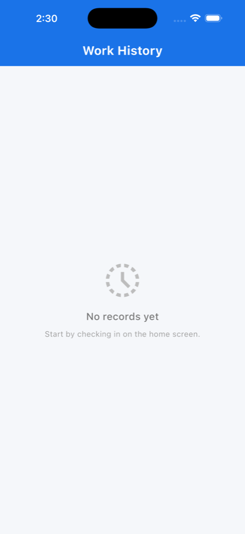
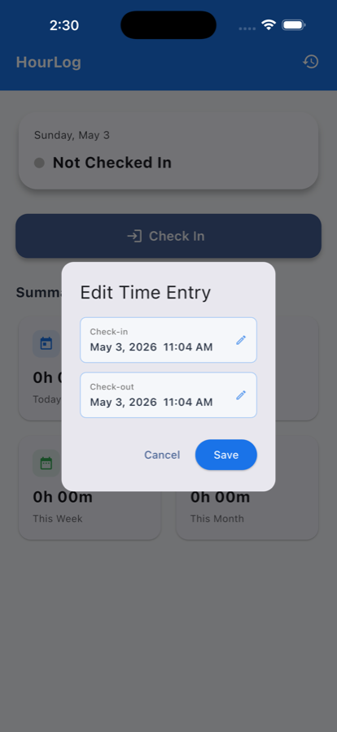

# HourLog ⏱️

A compact, delightful time-tracking Flutter app for quick check-ins and history review.

Whether you want a minimal personal time logger or a clean example of Provider + Sqflite usage, HourLog is compact, readable, and easy-to-extend.

---

## ✨ Highlights

- Lightweight offline-first time tracking using `sqflite`.
- Simple check-in / check-out flow with history, editing, and per-day/week/month totals.
- Dependency-free UI widgets where possible; provider-based state management.
- Focused on clarity — easy to read and extend for new features.
- Includes seeded sample records for a ready-to-run demo experience on fresh installs.

---

## 📸 iOS Screenshots

<div>
  
  
  
</div>

<small>Rendered smaller for quick preview in the README.</small>

---

##  Quick Start

Prerequisites:

- Flutter SDK (stable)
- A connected device or simulator

Run locally:

```bash
flutter pub get
flutter run
```

> On an untouched install, the app seeds a few sample time records automatically so you can explore the UI without manual data entry.

Run static analysis:

```bash
flutter analyze
```

Run tests (if any):

```bash
flutter test
```

## 🧭 How it works (overview)

- The UI reads and updates data through `TimeProvider` (a `ChangeNotifier`) which wraps a tiny `DatabaseHelper` built on `sqflite`.
- Checking in inserts a `TimeRecord` with a `check_in` timestamp; checking out writes `check_out` and recomputes totals.
- The History screen groups records by day and shows a compact list with editing and deletion support.

Key implementation notes:

- Stateless components: the home screen's visual parts were extracted to `lib/screens/components/home_screen_components.dart` to keep `HomeScreen` focused on lifecycle and animation concerns.
- Chart sizing: `weekly_bar_chart.dart` uses a bounded `SizedBox` to prevent RenderFlex unbounded-height errors when embedded in scrollable content.

---

## 🛠️ Development notes & tips

- If you see a RenderFlex error mentioning "incoming height constraints are unbounded", check the chart widget and ensure its vertical size is bounded (the project already adds a `SizedBox` to the chart).
- Use `flutter analyze` frequently — the project is configured for clean analyzer output.
- To add features, start by updating `TimeProvider` and then surface actions in the UI via the provider.

---

## 🎯 Contributing

Contributions are welcome — open an issue or create a PR. Keep changes small and focused; add tests where appropriate.

Suggested workflow:

1. Create a feature branch.
2. Run `flutter analyze` and `flutter test`.
3. Open a PR with a short description of the intent.

---

## ⚖️ License

No license file is included by default. Add a `LICENSE` file to clarify usage and contribution terms.

---

## 📬 Contact

If you'd like help extending the project or integrating it with a backend, open an issue or reach out in the repo.

Happy hacking! 🧡

